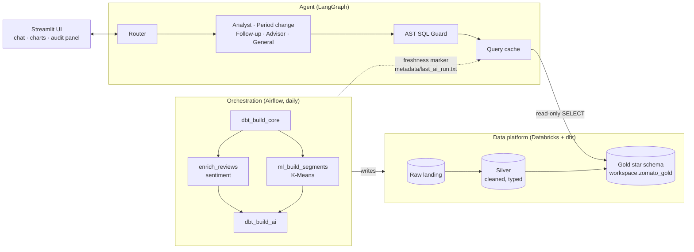
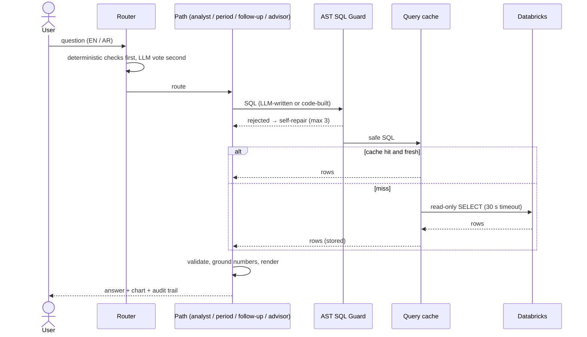
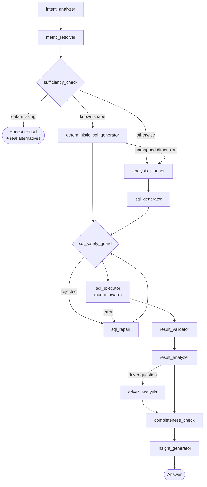
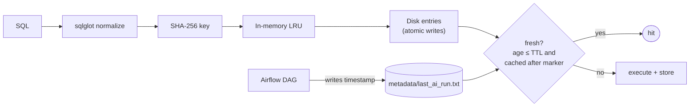

# Architecture

This document explains how the Agentic Data Lakehouse is put together: what runs where, how a question flows through the system, and why the design favors deterministic code over LLM calls wherever the answer can be computed or verified.

- [1. System overview](#1-system-overview)
- [2. Request lifecycle](#2-request-lifecycle)
- [3. Routing](#3-routing)
- [4. The analyst pipeline](#4-the-analyst-pipeline)
- [5. Deterministic paths](#5-deterministic-paths)
- [6. Safety layers](#6-safety-layers)
- [7. Caching and freshness](#7-caching-and-freshness)
- [8. LLM strategy](#8-llm-strategy)
- [9. Data platform](#9-data-platform)
- [10. Orchestration](#10-orchestration)
- [11. Observability](#11-observability)
- [12. Design principles and known limits](#12-design-principles-and-known-limits)

---

## 1. System overview



| Layer | Technology | Responsibility |
| :--- | :--- | :--- |
| Storage & compute | Databricks SQL warehouse, Delta Lake | Medallion tables, Unity Catalog |
| Transformation | dbt | Bronze → Silver → Gold, tests, incremental merges |
| Orchestration | Airflow (Docker) | Daily build, AI enrichment, cache-invalidation marker |
| Agent | LangGraph, `sqlglot`, Groq (OpenRouter fallback) | Routing, planning, guarded SQL, verification |
| Delivery | Streamlit, Plotly | Chat, charts, "How I got this" audit panel |

---

## 2. Request lifecycle



Two properties hold for every data-touching route: **all SQL passes the same guard**, and **all results pass through the same cache**.

---

## 3. Routing

[`router_graph.py`](src/agent/router_graph.py) decides the route. Cheap, deterministic checks run **before** the LLM vote can matter:

| Route | Chosen when | LLM usage |
| :--- | :--- | :--- |
| `PERIOD_CHANGE` | The question asks for the biggest week/month change (parser in [`period_change.py`](src/agent/period_change.py)). Decided before any LLM call. | None (verified by test) |
| `FOLLOWUP` | "Why / what should I do" or "add their city & rating" about restaurants already on screen. | Answer built by code; the router still classifies first |
| `ADVISOR` | Opinion or decision questions ("which is best, one name"). Answered from stored rows only. | Answer from stored rows |
| `ANALYSIS` | Any other data question. | Varies with the question shape (none for the fast path's SQL and narration) |
| `GENERAL` | Everything else. | One generation |

The router classifies the route and **prefetches the analyst's intent in parallel**; the prefetch is discarded when the route is not `ANALYSIS`. If the router LLM fails (rate limit, malformed tool call), questions with data terms still go to the analyst rather than to a model that has no data.

> The `confidence` shown in the UI caption is the router's **route-classification** confidence. It is not a measure of answer correctness.

---

## 4. The analyst pipeline

[`analyst_graph.py`](src/agent/analyst_graph.py) is a LangGraph state machine of 15 nodes:



- **Intent** combines an LLM step with deterministic parsing: the requested N, sort direction, singular vs list, the ranked dimension, and derived measures are read from the question text and override whatever the LLM guessed.
- **Sufficiency** refuses metrics that cannot be computed (for example profit has no cost data) and lists the metrics that *can* be computed.
- **Executor** serves each query from cache when fresh, runs the rest concurrently, preserves result order, and logs every query.
- **Insight generator** renders rankings as a table with deterministic observations (no LLM narration); other results are narrated by the LLM under grounding rules.
- **Completeness** verifies that requested derived columns (for example a share column) are actually in the result, and the answer discloses it when they are not.

---

## 5. Deterministic paths

### 5.1 Fast path for rankings
A single metric, at most one dimension, no filters and no time period: SQL is generated from the metric catalog with no LLM planner and no narration. Top-N and direction come from the question, with a tie-breaker (`ORDER BY metric, 1`) for stable output. Anything the fast path cannot express (for example an unknown dimension) falls back to the planner.

### 5.2 Derived measures
"Percentage contribution", "share of total" and similar phrases are detected from the question and from LLM metric names such as `percentage_of_total_revenue`, which are mapped back to the base metric. The SQL adds `ROUND(100 * m / SUM(m) OVER (), 2)`, evaluated over all groups before `LIMIT`. Share is offered only for additive metrics (revenue, total orders, total discount); ratios and averages go to the planner.

### 5.3 Period-over-period analysis
[`period_change.py`](src/agent/period_change.py) answers "which week/month had the biggest drop/rise" with three guarded queries:

1. **Extreme period.** Builds the series of *full* periods inside the data coverage (`DATE_TRUNC`, partial edge periods excluded), takes consecutive differences with `LAG`, and returns the most extreme change with the number of comparisons, a trailing baseline and the standard deviation of period-over-period changes.
2. **Contributors.** For that exact period pair, per brand: previous, current, change, % change, and share of the total change (a window over all brands, before `LIMIT`).
3. **Drivers.** Orders, average order value, active branches, customers and failed-order rate for both periods; the revenue change is split exactly into an order-volume effect and a basket-size effect.

The renderer then adds the honesty layer: it compares the change with normal variability (z-score; below 3.5 is reported as consistent with chance), notes regression to the mean when the previous period was unusually high or low, and lists what the data cannot show (traffic, marketing, seasonality, weather).

### 5.4 Follow-up diagnosis and enrichment
[`followups.py`](src/agent/followups.py) and [`diagnostics.py`](src/agent/diagnostics.py) operate on the restaurants of the previous result:

- **Enrichment** keeps the same restaurants, order and metric values and adds the requested attributes.
- **Diagnosis** benchmarks each restaurant against the platform, its city and its cuisine, decomposes the ranked metric (orders = branches × orders per branch; revenue additionally × average order value), ranks deviations as root-cause candidates, and attaches an action with a target KPI.
- **Metric awareness:** the ranked metric is read from the previous result's columns. For an order-count question the basket-size factor is excluded from both the decomposition and the causes.
- **Confidence:** tiered by sample size (high at 200+ orders, medium at 30+, otherwise low). Below 30 orders, failed-order findings require the 95% Wilson interval to exclude the benchmark. "Below same-city peers" is shown as context that restates the gap, never as a root cause.

### 5.5 Advisor
[`advisor.py`](src/agent/advisor.py) answers "which is best / should I invest" from stored rows only: criterion, measured facts, calculated findings, limits (no cost/profit/trend data) and next analyses are kept separate.

---

## 6. Safety layers

| Layer | Where | What it enforces |
| :--- | :--- | :--- |
| Token budget | [`token_budget.py`](src/agent/token_budget.py) | 60k tokens per session, 180k per day (configurable) |
| AST SQL guard | [`sql_safety_guard.py`](src/agent/sql_safety_guard.py) | Exactly one `SELECT`; schema `workspace.zomato_gold` only; no DDL/DML; blocks `read_files`, `http_request`, `remote_query`, `ai_query`; injects `LIMIT 10000` |
| Strict interpolation | `period_change.py` | Values placed into SQL (dates) must fully match `YYYY-MM-DD`; a longer string is rejected, never truncated |
| Least privilege | [`scripts/databricks_grants.sql`](scripts/databricks_grants.sql) | Service principal with `SELECT` on Gold only |
| Result classification | [`result_classifier.py`](src/agent/result_classifier.py) | No rows / all NULL / all zero are explained from real coverage dates, never narrated |
| Numeric grounding | [`numeric_grounding.py`](src/agent/numeric_grounding.py) | Narrative numbers must match executed results, including Arabic-Indic numerals and unit scaling |
| Narrative rules | [`analyst_prompts.py`](src/agent/analyst_prompts.py) | No "majority/bulk" claims without a computed share above 50% |
| Resilience | [`database.py`](src/utils/database.py), [`llm_factory.py`](src/agent/llm_factory.py) | 30 s statement timeout, bounded pool with reconnect, circuit breaker with provider fallbacks |

Databricks string literals use backslash-escaped apostrophes: `'McDonald''s'` is two concatenated literals in Spark SQL and silently matches nothing.

---

## 7. Caching and freshness



| Cache | Key | TTL | Notes |
| :--- | :--- | :--- | :--- |
| Query results ([`query_cache.py`](src/agent/query_cache.py)) | normalized SQL | 1 h | Bounded by entries and bytes, identical concurrent queries coalesce, hit/miss counters |
| LLM responses ([`llm_cache.py`](src/agent/llm_cache.py)) | node + model + effort + full prompt | 24 h | Invalid outputs are never cached; bypassed when the LLM is overridden (tests) |
| Gold schema | in-process | 1 h | Introspected in parallel |
| Data coverage | in-process | 1 h | Used to explain empty results |

**Freshness contract.** The DAG writes the marker after `dbt_build_core` *and* after `dbt_build_ai`. Query results, schema and coverage cached before the marker are stale. Writing the marker after the core build matters because the Gold facts change there; if an AI step fails later, cached answers must still not survive.

**Isolation.** Query keys are the normalized, fully qualified SQL, so different filters or contexts produce different keys. A cache hit is recorded explicitly in the executed-SQL log, so hits are verified from telemetry rather than inferred from response speed.

---

## 8. LLM strategy

Per-node model and reasoning effort are configured in [`router_config.py`](src/agent/router_config.py) (`NODE_LLM_PROFILES`):

| Node | Model | Effort |
| :--- | :--- | :--- |
| `intent_analyzer` | `gpt-oss-20b` | low |
| `analysis_planner` | `gpt-oss-120b` | low |
| `sql_generator` | `gpt-oss-120b` | medium |
| `sql_repair`, `result_analyzer`, `driver_analysis` | `gpt-oss-120b` | low |
| `insight_generator` | `gpt-oss-120b` | medium |

Planning and SQL writing stay separate calls so reasoning and syntax do not share one prompt. A circuit-breaker LLM wrapper is the single retry layer, shares breaker state per provider and model, and falls back to a second provider. Independent repair calls and the analyzer/driver pair run concurrently.

The biggest saving comes from not calling the LLM at all: rankings, period analysis, enrichment and diagnosis are code.

---

## 9. Data platform

```text
Raw ──► Bronze ──► Silver (clean, typed, deduplicated) ──► Gold (Kimball star schema)
```

| Table | Grain |
| :--- | :--- |
| `fact_orders` | one row per order (~10M) |
| `fact_order_items` | one row per line item (~23M) |
| `dim_resturant` | one row per **branch**; `restaurant_name` is the brand |
| `dim_menu`, `dim_users`, `dim_date` | menu item, customer, calendar date |
| `ai_customer_segments` | one row per customer (K-Means segment), joined into `dim_users` |

dbt runs with 8 threads. Orders and order items are incremental merges (timestamp watermark with a 3-day lookback; anti-join on loaded keys for items). `dbt build --full-refresh` rebuilds from scratch. Every model has primary-key, not-null and relationship tests.

---

## 10. Orchestration

DAG `zomato_ai_pipeline_databricks` runs daily with `max_active_runs=1`, retries with exponential backoff, and per-task and per-run timeouts:

`dbt_build_core` → (`enrich_reviews` ∥ `ml_build_segments`) → `dbt_build_ai`

- `enrich_reviews`: incremental, de-duplicated sentiment classification in batches of 25 reviews per request, with bounded concurrency and `retry-after` backoff (cap via `ENRICH_MAX_REVIEWS`).
- `ml_build_segments`: K-Means over frequency, average order value and recency; loaded with one Parquet file, a `PUT` into a Unity Catalog volume and `CREATE OR REPLACE TABLE … AS SELECT`.
- A shell snippet writes a UTC timestamp to `metadata/last_ai_run.txt` after each dbt build that changes Gold. The folder is shared with the app through a Docker volume.

---

## 11. Observability

| Artifact | Content |
| :--- | :--- |
| `eval/llm_telemetry.jsonl` | One line per LLM call: node, provider, model, fallback flag, retries, prompt / completion / reasoning tokens, `finish_reason`, wall time |
| `eval/executed_sql.jsonl` | One line per query: question, purpose, SQL, cache hit, row count, seconds, error |
| UI audit panel | Executed SQL, row counts, per-node latency, per-turn LLM telemetry |

The LLM-call counter in the UI counts real telemetry records, so cache hits and deterministic turns show zero. Both logs are git-ignored, and tests redirect them to temporary files.

---

## 12. Design principles and known limits

**Principles**

1. **Code over LLM** wherever the answer can be computed or verified.
2. **One guard, one cache** for every route that touches data.
3. **Say what you cannot know.** Refuse, qualify, or report "likely chance" rather than invent a cause.
4. **Evidence travels with the answer.** Every figure maps to an executed query.
5. **Fail closed.** Unknown dimension, rejected SQL or failed query produces an explanation, not a guess.

**Known limits**

- A cold SQL warehouse can add roughly 25–30 s to the first query after idle. Mitigate by shortening the warehouse auto-stop interval or adding a keep-alive.
- Top-N results with ties at the cutoff use an alphabetical tie-breaker; other tied entities are not yet disclosed.
- Share-of-total is limited to additive metrics.
- The freshness marker has one-second resolution and is only written when the Airflow DAG runs.
- The data has no traffic, marketing, cost or seasonality fields, so explanations are limited to what orders, baskets, branches, ratings and failures can show.

For the history behind these choices see [DECISIONS.md](DECISIONS.md).
