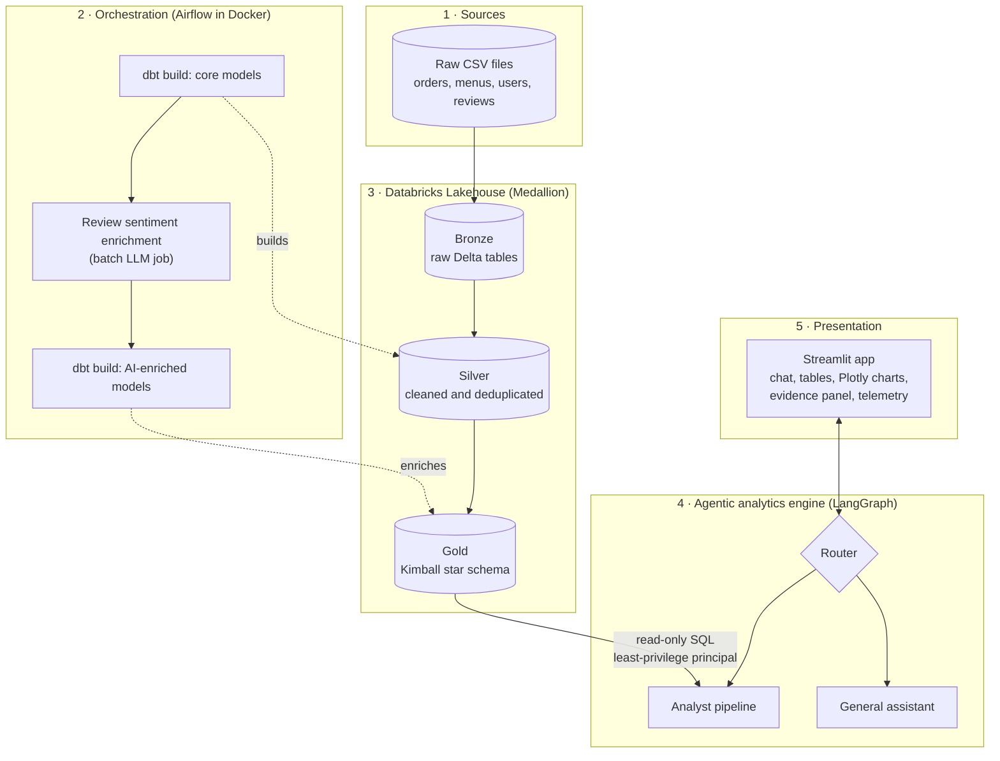
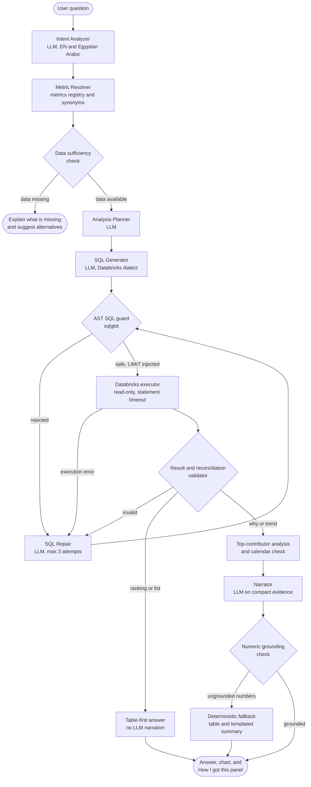
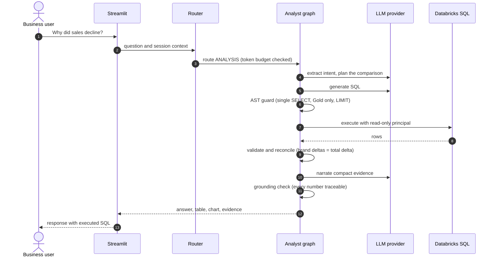
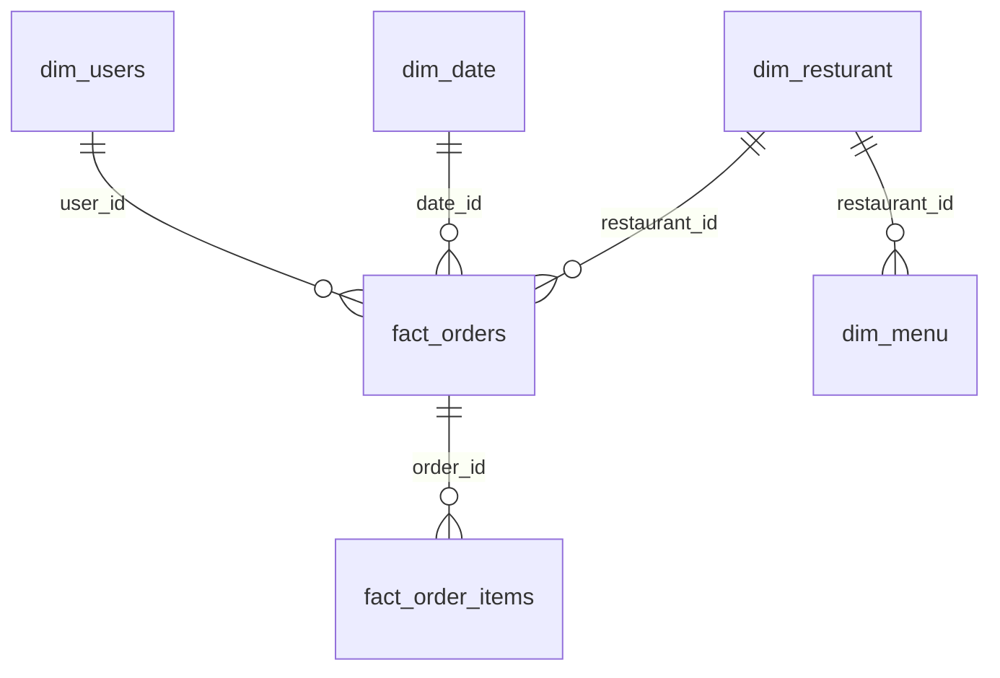
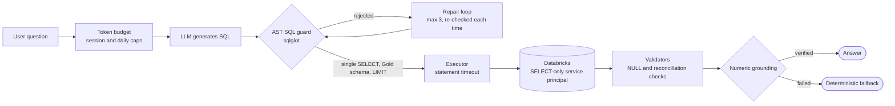

# Agentic Data Lakehouse

**An agentic AI data analyst on a Databricks lakehouse: guarded SQL generation, verified numbers, and honest answers in English and Arabic.**


> Ask a business question in plain English or Arabic. The agent plans the analysis, writes SQL, runs it read-only against the Gold layer of a Databricks lakehouse, validates the result, and answers with evidence you can audit.

<!--
Add screenshots after placing them in docs/assets/, then uncomment:


-->

---

## Contents

1. [Why this project](#why-this-project)
2. [Architecture](#architecture)
3. [The analyst pipeline](#the-analyst-pipeline)
4. [Example: a "why" question](#example-a-why-question)
5. [Data platform](#data-platform)
6. [Security and reliability](#security-and-reliability)
7. [Design decisions](#design-decisions)
8. [Tech stack](#tech-stack)
9. [Getting started](#getting-started)
10. [Configuration](#configuration)
11. [Testing](#testing)
12. [Project structure](#project-structure)
13. [Known limitations and roadmap](#known-limitations-and-roadmap)
14. [Author](#author)

---

## Why this project

Plain text-to-SQL demos break down in practice: the model writes a query that runs but answers the wrong question, then narrates numbers it never computed. This project treats the LLM as one component inside a pipeline that **verifies everything around it**.

| Typical text-to-SQL demo | This project |
|---|---|
| LLM writes SQL, the app runs it | SQL is parsed to an AST and checked before execution |
| Regex or keyword blocklist for safety | `sqlglot` guard plus a least-privilege, read-only Databricks principal |
| LLM writes the final text from raw rows | Rankings are rendered as tables without an LLM; narratives are checked number by number against the query result |
| Wrong query, confident answer | Validators reject all-NULL and non-reconciling results and route them to repair |
| Missing data gets invented | Missing metrics (for example profit without cost data) are refused with alternatives |
| "Why" questions blame the top row | The narrative reports how concentrated the change is and whether period lengths differ |

**Key capabilities**

- Natural-language questions in English and Arabic (including Egyptian dialect).
- Multi-step analysis planning: period comparisons, rankings, trends, top contributors.
- AST-based SQL safety guard and a self-repair loop capped at three attempts.
- Numeric grounding: every number in a generated answer must trace back to executed query results.
- Table-first answers for rankings and lists (no LLM narration, lower latency and token cost).
- "How I got this" panel with the exact SQL, row count, and timestamp of every answer.
- Per-call LLM telemetry and per-session / daily token budgets.
- End-to-end data platform: Airflow, dbt, and a Databricks Medallion lakehouse with a Kimball star schema.

---

## Architecture



| Layer | Responsibility | Where |
|---|---|---|
| Sources | Raw Zomato-style food-delivery data | Bronze tables |
| Orchestration | Daily DAG: dbt core build, review sentiment enrichment, dbt AI-model build | `airflow/dags/zomato_dag.py` |
| Lakehouse | Bronze, Silver, Gold (Kimball star schema) on Delta Lake | `zomato_dbt/`, `workspace.zomato_gold.*` |
| Agent engine | Routing, analysis pipeline, SQL guard, validators, grounding | `src/agent/` |
| Presentation | Chat UI, charts, evidence and telemetry panels | `app.py`, `src/agent/viz_engine.py` |

---

## The analyst pipeline



| Stage | Type | What it does |
|---|---|---|
| Intent Analyzer | LLM | Extracts intent, metrics, dimensions, filters, and time range from English or Egyptian Arabic questions |
| Metric Resolver | Python | Maps business terms to registry metrics and injects the exact SQL formulas |
| Sufficiency check | Python | Stops early when required data does not exist (for example profit needs cost data) and lists what can be answered |
| Analysis Planner | LLM | Breaks complex questions into a plan, for example a single-pass period comparison |
| SQL Generator | LLM | Produces Databricks SQL following registry grains (brand level vs branch level) |
| AST SQL guard | Python | Single SELECT, Gold schema only, no `SELECT *`, no table-valued functions, injected `LIMIT` |
| SQL Repair | LLM | Fixes rejected or failing SQL; every rewrite goes back through the guard; max three attempts |
| Executor | Python | Runs on a shared, thread-safe connection with reconnect and a statement timeout |
| Result validator | Python | Rejects empty results, all-NULL derived columns, and period comparisons whose deltas do not reconcile with the total |
| Table-first answer | Python | Renders rankings and lists as tables plus a chart with no LLM call |
| Narrator | LLM | For "why" and trend questions, writes from a compact evidence object only |
| Numeric grounding | Python | Checks every number and quantifying claim in the text against the evidence; falls back to a deterministic answer |

---

## Example: a "why" question

The request flow for *"Why did sales decline? Which restaurants contributed most?"*:



Illustrative output on the development dataset (May to June 2026):

> Total sales fell from 234,738,456 to 224,736,724 (-10,001,732, about -4.3%).
> The two periods have different lengths (31 vs 30 days); average daily sales changed by about -1.07%.
> The five largest decliners (KFC, Domino's Pizza, Pizza Hut, Subway, Behrouz Biryani) together account for about 5.5% of the net decline, so the drop is broadly distributed rather than driven by a single brand.

The narrative rules that produce this behavior are enforced in code: a top contributor is not presented as "the cause" when the top five explain less than 20% of the change, and differing period lengths are always surfaced.

Other questions the system handles:

| Question | Behavior |
|---|---|
| "Top 15 restaurants by sales and orders" | Table-first: SQL result rendered directly with a chart, no narration call |
| "Show revenue by month" / "What is the month-over-month growth?" | Trend query with a line chart |
| "What is the profit margin of our top restaurants?" | Refused with an explanation: cost data is not in the warehouse; lists the metrics that are available (sales, orders, AOV, discount rate) |
| "عاوز اكتر 15 مطعم في المبيعات وكل مطعم عمل كام اوردر" | Arabic and Egyptian dialect are understood; the answer follows the question language |

---

## Data platform

### Medallion layers

| Layer | Content |
|---|---|
| Bronze | Raw landing tables (Delta) |
| Silver | Type casting, deduplication, missing-value handling |
| Gold | Kimball star schema in `workspace.zomato_gold` |

### Gold star schema



| Table | Grain | Key columns | Rows (dev dataset) |
|---|---|---|---|
| `fact_orders` | one row per order | `order_id`, `user_id`, `restaurant_id`, `date_id`, `sales_amount`, `discount`, `delivery_time_min` | 10,000,000 |
| `fact_order_items` | one row per order line item | `order_id`, `food_id`, `quantity`, `price` | about 23,000,000 |
| `dim_resturant` | one row per restaurant branch | `restaurant_id`, `restaurant_name`, `city`, `rating`, `affordability_tier` | 148,541 |
| `dim_menu` | one row per menu item | `menu_id`, `restaurant_id`, `item_name`, `veg_or_non_veg`, `cuisine` | 1,179,936 |
| `dim_users` | one row per user | `user_id`, `age_group`, `gender`, `occupation`, `monthly_income` | 100,000 |
| `dim_date` | one row per date | `date_id`, `full_date`, `year`, `month_name`, `day_type` | 912 |

Notes:

- `dim_resturant` keeps its original spelling to stay compatible with the existing warehouse objects.
- **Grain matters.** `restaurant_id` identifies a branch; `restaurant_name` identifies a brand. The metrics registry makes the grain explicit so brand-level questions are not answered with branch-level rows.

### Pipeline (Airflow + dbt)

The Airflow DAG (`airflow/dags/zomato_dag.py`, run in Docker) executes:

1. `dbt_build_core`: builds Bronze, Silver, and the core Gold models.
2. `enrich_reviews`: a batch job that calls an LLM to classify review sentiment (positive, negative, neutral).
3. `dbt_build_ai`: merges the enrichment results into the Gold models.

---

## Security and reliability

Defense in depth: no single layer is trusted to be perfect.



| Control | What it protects against |
|---|---|
| **AST SQL guard** (`sqlglot`, Databricks dialect) | Multi-statement input, DDL/DML, comment tricks, `SELECT *`, table-valued functions such as `read_files`, access outside `workspace.zomato_gold`; injects `LIMIT 10000` |
| **Repair loop re-enters the guard** | LLM-rewritten SQL can never reach the warehouse unchecked; capped at three attempts |
| **Least-privilege principal** (`scripts/databricks_grants.sql`) | Even if the guard were bypassed, the credentials can only `SELECT` from the Gold schema |
| **Token budgets** (`token_budget.py`) | Runaway cost and free-tier exhaustion; friendly message when a session or daily cap is reached |
| **Connection handling** | Shared, thread-safe connection with reconnect on stale sessions; connection faults are retried without consuming LLM repair attempts |
| **Numeric grounding** | Invented numbers and unsupported claims in generated text |
| **Gated ETL agent** | The ETL/API-extraction agent is disabled by default (`ENABLE_ETL_AGENT=false`); its URL fetching is hardened against SSRF (scheme allowlist, private/loopback/link-local/metadata ranges blocked, size and time limits) |
| **Quarantined legacy agent** | The old keyword-filter SQL agent was removed from routing and moved to `quarantine/` |

Observability: every LLM call records node, provider, model, fallback flag, retries, prompt/completion/reasoning tokens, and wall time, and the UI shows per-stage latency. Logs are gitignored.

---

## Design decisions

The full log lives in [`docs/DECISIONS.md`](docs/DECISIONS.md). Highlights:

| Decision | Reason (measured where noted) |
|---|---|
| Replace regex SQL filtering with an AST guard | Regex is bypassable with comments, CTEs, and table-valued functions |
| Drop the `EXPLAIN` pre-check | After connection reuse `EXPLAIN` cost about 0.56 s (p50) while executing the query itself cost about 0.42 s, so it only added latency; syntax and column errors come back from Databricks and go straight to repair |
| Reuse one long-lived connection | Opening a new connection per query cost about 1.4 s (p50); reuse brought it to near zero |
| Table-first answers for rankings | Nothing to narrate; removes an LLM call and eliminates narrative errors on list answers |
| Reconciliation validator | A comparison query can run without errors and still return NULL deltas or drop restaurants that stopped selling; totals must reconcile |
| Numeric grounding with strict suffix matching | Avoids accepting an invented number that happens to match a scaled value by coincidence; ignores list numbering |
| Honest narrative rules | Top-N rows are not presented as "the cause" when the change is broadly distributed; calendar effects (31 vs 30 days) are disclosed |
| Retire `SELECT`-any legacy SQL route | Two code paths to the database meant two security models |

Measured on the development SQL warehouse (Photon), 10M-row `fact_orders`: a top-15 restaurant ranking executes in about 0.5 s and a month-over-month brand comparison in about 3 s. End-to-end latency is dominated by LLM providers and their rate limits, which is why per-call telemetry exists.

---

## Tech stack

| Area | Technology |
|---|---|
| Lakehouse | Databricks SQL warehouse, Delta Lake, Unity Catalog grants |
| Transformations | dbt |
| Orchestration | Apache Airflow (Docker) |
| Agent framework | LangGraph, LangChain |
| LLM providers | Groq (primary), OpenRouter (optional fallback); models are configurable |
| SQL analysis | `sqlglot` |
| UI and charts | Streamlit, Plotly |
| Testing | pytest |

---

## Getting started

### Prerequisites

- Python 3.12 or newer
- A Databricks workspace with a SQL warehouse and the Gold schema built by the dbt project
- A Groq API key (an OpenRouter key is optional, for fallback)
- Docker (only for the Airflow pipeline)

### Install

```bash
git clone https://github.com/shehapsherif11-bit/Agentic-Data-Lakehouse.git
cd Agentic-Data-Lakehouse

python -m venv venv
# Windows (PowerShell)
venv\Scripts\Activate.ps1
# macOS / Linux
source venv/bin/activate

pip install -r requirements.txt
```

### Configure

```bash
cp .env.example .env        # Windows PowerShell: Copy-Item .env.example .env
```

Fill in the values (see [Configuration](#configuration)). Never commit `.env`.

For the database credentials, create a dedicated service principal and grant it read-only access with [`scripts/databricks_grants.sql`](scripts/databricks_grants.sql); use that principal's token in `.env`.

### Run the app

```bash
streamlit run app.py
```

### Build the data models (optional)

```bash
cd zomato_dbt
dbt build        # requires a dbt profile pointing at your Databricks workspace
```

The scheduled pipeline is defined in `airflow/dags/zomato_dag.py`.

---

## Configuration

| Variable | Required | Description |
|---|---|---|
| `DATABRICKS_HOST` | yes | Workspace hostname |
| `DATABRICKS_HTTP_PATH` | yes | SQL warehouse HTTP path |
| `DATABRICKS_TOKEN` | yes | Token of the read-only service principal |
| `GROQ_API_KEY` | yes | Groq API key |
| `OPENROUTER_API_KEY` | no | Fallback provider key |
| `OPENROUTER_MODEL` | no | Fallback model identifier |
| `ENABLE_ETL_AGENT` | no | `false` by default; leave disabled unless you understand the risks |

Free-tier LLM plans have daily token limits. The built-in token budget and provider fallback exist for this reason; see [Known limitations](#known-limitations-and-roadmap).

---

## Testing

```bash
python -m pytest tests/ -v
```

The suite covers:

- **SQL guard**: parametrized accept/reject cases (multi-statement, hidden DDL, table-valued functions, system and foreign schemas, `t.*`, unions and subqueries on forbidden tables, mixed case, backtick quoting, preserved `LIMIT`).
- **Numeric grounding**: list numbering, scaled suffixes (for example `14M`), fabricated numbers, Arabic-Indic digits, unsupported narrative claims.
- **Validators**: all-NULL derived columns, total-delta reconciliation.
- **Graph behavior**: repair success, repair exhaustion (executor never called on forbidden SQL), connection retry without consuming repairs.
- **Router**: rate-limit handling, state reset between questions.
- **Security**: no unguarded SQL route, ETL flag default, SSRF protections, path traversal.
- **Metrics registry, telemetry, and visualization** helpers.

---

## Project structure

```text
Agentic-Data-Lakehouse/
├── app.py                      # Streamlit entry point
├── cli.py                      # Terminal interface
├── config.py                   # Settings
├── requirements.txt
├── .env.example
├── src/
│   ├── agent/                  # LangGraph pipelines and agent logic
│   │   ├── router_graph.py     #   master router
│   │   ├── analyst_graph.py    #   analyst pipeline
│   │   ├── analyst_state.py    #   state and evidence objects
│   │   ├── analyst_prompts.py  #   prompts
│   │   ├── metrics_registry.py #   metrics, grains, schema catalog
│   │   ├── sql_safety_guard.py #   AST SQL guard
│   │   ├── numeric_grounding.py#   numeric and narrative grounding
│   │   ├── token_budget.py     #   session and daily budgets
│   │   ├── llm_factory.py      #   provider factory with fallback
│   │   ├── viz_engine.py       #   Plotly charts
│   │   └── etl_agent.py        #   gated, disabled by default
│   ├── tools/
│   │   └── etl_tools.py        # hardened URL extraction (SSRF protections)
│   └── utils/
│       └── database.py         # Databricks connection handling
├── airflow/dags/               # Scheduled pipeline
├── zomato_dbt/                 # dbt project (Bronze, Silver, Gold)
├── scripts/
│   └── databricks_grants.sql   # least-privilege grants
├── quarantine/                 # retired, unsafe legacy code (not imported)
├── tests/                      # pytest suite
└── docs/
    └── DECISIONS.md            # architecture decision log
```

---

## Known limitations and roadmap

**Limitations**

- SQL is generated by an LLM and is therefore not deterministic: the same question can produce different (valid) queries. The guard, validators, and reconciliation reduce the risk but do not remove it.
- Built and evaluated on a single food-delivery dataset.
- Free-tier LLM plans impose daily token limits and rate limits; answers can be slow or fall back to a smaller model when quotas are exhausted.
- The ETL agent is disabled by default and is not part of the supported feature set.

**Roadmap**

- Benchmark models per pipeline role (intent, SQL, narration) and publish the results.
- Reduce LLM calls per question by merging intent and planning into one structured call.
- Deterministic query compiler for the most common intents (ranking, period comparison), keeping LLM SQL as a fallback.
- Golden-question evaluation set with a resumable runner and CI.
- Clarification flow for ambiguous questions.
- Hosted demo.

---

## Author

Built by **Shehab**, Data Analyst and BI Developer, as an end-to-end data engineering and applied AI portfolio project.

GitHub: [@shehapsherif11-bit](https://github.com/shehapsherif11-bit)
