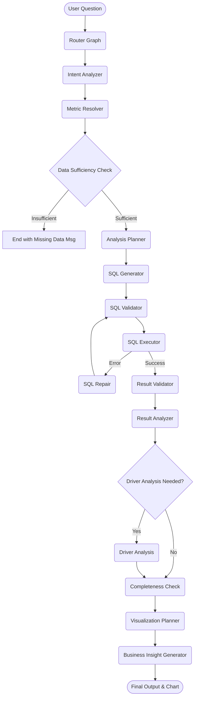

# 📊 Agentic AI Data Analyst
> Ask your data a business question and let the agent investigate it.

## Overview

This project features an **Agentic AI Data Analyst** powered by **LangGraph**. It is **NOT** a simple text-to-SQL generator. Instead, it behaves like an experienced human data analyst: it receives a business question, understands the intent, plans a multi-step analytical approach, writes and validates SQL queries, executes them against the database, analyzes the returned data, performs root-cause analysis if needed, and finally delivers a cohesive, evidence-based business insight complete with visualizations.

## Architecture



## Agent Workflow

| Node | Description |
|---|---|
| **Intent Analyzer** | Analyzes the business question to extract metrics, dimensions, filters, and intent. |
| **Metric Resolver** | Maps user terms to standard business metrics (e.g., "sales" -> "revenue"). Detects derivable or missing metrics. |
| **Sufficiency Check** | Validates if the data required for the request actually exists before proceeding. |
| **Analysis Planner** | Breaks down complex questions into an analytical plan with multiple sub-queries. |
| **SQL Generator** | Generates Databricks-dialect SQL for all steps in the plan. |
| **SQL Validator** | Validates generated SQL against the schema, joins, and syntax rules. |
| **SQL Executor** | Executes queries against the Databricks cluster safely. |
| **SQL Repair** | Conditional node that attempts to repair failing SQL queries. |
| **Result Validator** | Sanity-checks the returned results for logical correctness. |
| **Result Analyzer** | Parses results to extract findings and key numbers. |
| **Driver Analysis** | Automatically breaks down data by dimensions to investigate "why" metrics changed (e.g., root cause analysis). |
| **Completeness Check**| Ensures the final analysis answers the original user question fully. |
| **Viz Planner** | Determines if a chart is needed and generates interactive Plotly visualizations. |
| **Insight Generator** | Compiles all evidence, data, and driver analysis into a natural language response. |

## Supported Analytical Capabilities

- **Simple queries**: Filtering and aggregations.
- **Derived metrics**: On-the-fly calculation of AOV, discount rate, items per order.
- **Temporal analysis**: Automated WoW, MoM growth calculations and trend lines.
- **Driver / root-cause analysis**: Answering "Why?" questions by finding contributing dimensions.
- **Multi-step complex questions**: Executing multi-query plans to piece together a story.
- **Intelligent visualization**: Auto-generating line charts, bar charts, and pie charts via Streamlit/Plotly.
- **Data sufficiency detection**: Refusing politely when asked for missing data (e.g., profit margin without COGS data) instead of hallucinating.
- **SQL validation & repair**: Self-healing SQL queries.
- **Evidence-based answers**: Grounding all final text in actual database results.

## Database Schema (Zomato Gold)

The agent connects to a Databricks `workspace.zomato_gold` schema containing:

| Table | Grain | Key Columns |
|---|---|---|
| `fact_orders` | 1 row per order | `order_id`, `user_id`, `restaurant_id`, `date_id`, `sales_amount`, `discount`, `delivery_time_min` |
| `fact_order_items` | 1 row per line item | `order_id`, `food_id`, `quantity`, `price` |
| `dim_date` | 1 row per date | `date_id`, `full_date`, `year`, `month_name`, `day_type` |
| `dim_menu` | 1 row per menu item| `menu_id`, `restaurant_id`, `item_name`, `veg_or_non_veg`, `cuisine` |
| `dim_resturant` | 1 row per restaurant | `restaurant_id`, `restaurant_name`, `city`, `rating`, `affordability_tier` |
| `dim_users` | 1 row per user | `user_id`, `age_group`, `gender`, `occupation`, `monthly_income` |

## Example Questions

Here are some questions the agent is capable of handling across various complexities:

- **Simple:** "What are the top 5 restaurants by revenue?"
- **Simple:** "How many orders were placed last month?"
- **Trend:** "Show revenue by month."
- **Trend:** "What is the week-over-week revenue growth?"
- **Comparison:** "Compare average order value across cities."
- **Comparison:** "Which age group orders the most vegetarian food?"
- **Driver:** "Why did sales decline? Which restaurants contributed most?"
- **Derived Metric:** "What is the average order value trend over the last quarter?"
- **Derived Metric:** "Show me the discount rate by restaurant city."
- **Missing Data:** "What is the profit margin for our top restaurants?" *(Agent will politely explain that cost data is missing)*

## Example Analysis Flow

**User asks:** *"Which city had the highest revenue growth month over month?"*

1. **Intent Analyzer:** Identifies intent as temporal comparison (MoM), metric as `revenue`, dimension as `city`.
2. **Metric Resolver:** Finds `revenue_growth_mom` template and maps it to `sales_amount`.
3. **Analysis Planner:** Plans 2 queries: one for baseline MoM growth, one for dimensional breakdown by city.
4. **SQL Generator:** Writes the Databricks SQL queries utilizing window functions (`LAG()`).
5. **SQL Executor:** Runs the queries against Databricks.
6. **Result Analyzer:** Identifies the city with the largest positive delta.
7. **Insight Generator:** Constructs a response stating the winning city, the exact growth percentage, and outputs a supporting bar chart via the Viz Planner.

## Tech Stack

- **LangGraph**: Agent orchestration and state management
- **Groq LLMs**: Fast inference via `langchain_groq`
- **Databricks SQL**: Cloud data warehouse execution
- **dbt**: Data transformations (bronze → silver → gold pipeline)
- **Streamlit**: Conversational Web UI
- **Plotly**: Data visualization
- **Python 3.12**: Core runtime

## Project Structure

```text
d:\Data ENG Project\
├── app.py                      # Streamlit UI entrypoint
├── src/
│   ├── agent/
│   │   ├── analyst_graph.py    # Main LangGraph pipeline for the analyst
│   │   ├── analyst_state.py    # Agent state definitions
│   │   ├── metrics_registry.py # Metric definitions & schema catalog
│   │   ├── router_graph.py     # Master router logic
│   │   ├── viz_engine.py       # Visualization generator
│   │   └── analyst_prompts.py  # LLM Prompts
│   └── utils/
│       └── database.py         # Databricks connection utilities
├── tests/                      # Pytest suite
├── requirements.txt            # Python dependencies
└── README.md                   # This file
```

## Setup & Run

1. Install dependencies:
```bash
pip install -r requirements.txt
```

2. Configure your environment variables in a `.env` file:
```env
DATABRICKS_HOST=...
DATABRICKS_HTTP_PATH=...
DATABRICKS_TOKEN=...
GROQ_API_KEY=...
```

3. Run the Streamlit app:
```bash
streamlit run app.py
```

## Tests

Run the test suite using pytest:
```bash
python -m pytest tests/
```
