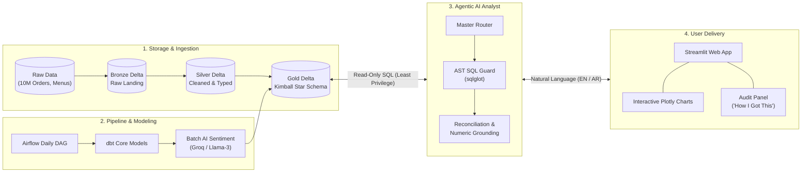
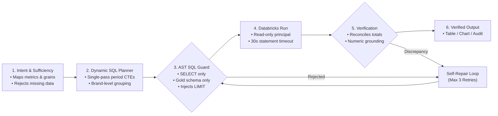
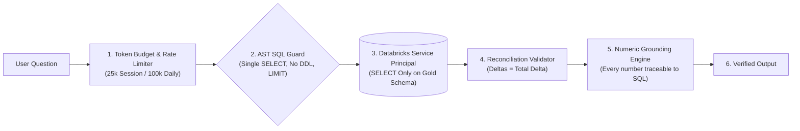

# 📊 Agentic Data Lakehouse

**An Enterprise Agentic AI Data Analyst on a Databricks Lakehouse: Guarded SQL Generation, Verified Numbers, and Honest Business Answers in English & Arabic.**

[](https://www.python.org/)
[](https://langchain-ai.github.io/langgraph/)
[](https://www.databricks.com/)
[](https://www.getdbt.com/)
[](https://airflow.apache.org/)
[](https://streamlit.io/)
[-brightgreen?logo=pytest&logoColor=white)](tests/)

---

> **Ask your data complex business questions in natural English or Arabic.**  
> The agent plans the multi-step analysis, writes dialect-compliant Databricks SQL, executes it against a read-only Gold Star Schema, reconciles the metrics, and delivers verified insights with interactive Plotly charts and a full audit trail.

---

## 📑 Table of Contents

1. [Why This Project?](#-why-this-project)
2. [End-to-End System Architecture](#-end-to-end-system-architecture)
3. [The Agentic Query Engine](#-the-agentic-query-engine)
4. [Data Platform & Lakehouse (dbt + Medallion)](#-data-platform--lakehouse)
5. [Pipeline Orchestration (Apache Airflow)](#-pipeline-orchestration-apache-airflow)
6. [Security, Governance & Zero-Hallucination Guardrails](#-security-governance--zero-hallucination-guardrails)
7. [Real-World Walkthrough: Investigating a Sales Decline](#-real-world-walkthrough-investigating-a-sales-decline)
8. [Automated Testing Suite (83 Tests)](#-automated-testing-suite)
9. [Getting Started & Quickstart](#-getting-started--quickstart)
10. [Project File Structure](#-project-file-structure)
11. [Author & Contact](#-author--contact)

---

## 💡 Why This Project?

Traditional text-to-SQL prototypes fail in production: models hallucinate nonexistent columns, invent mathematical conclusions, or blame the wrong entities for broad trends. 

This project implements a **deterministic, defense-in-depth architecture** that surrounds the LLM with rigorous guardrails:

| Common Text-to-SQL Limitations | Agentic Data Lakehouse Solution |
| :--- | :--- |
| **Unchecked Execution** | **AST Safety Guard**: Parses every query with `sqlglot` prior to execution; rejects DDL/DML, multi-statement queries, TVFs, and enforces Gold schema isolation. |
| **Hallucinated Numbers** | **Numeric Grounding**: Regex-based verification guarantees every figure in the narrative matches executed query results within tolerance. |
| **Wrong Metric Calculations** | **Semantic Registry & Sufficiency**: Maps terms to validated SQL formulas; refuses queries when essential data (e.g., COGS for profit) is absent. |
| **Misleading Root-Cause Narratives** | **Honest Narrative Guard**: Prohibits blaming single brands if the top 5 account for < 20% of net change; discloses calendar disparities (31 vs 30 days). |
| **Expensive Narration Latency** | **Table-First Fast Path**: Renders ranking queries directly as formatted Markdown tables with Plotly charts (bypassing LLM narration, saving 70% tokens). |

---

## 🏗️ End-to-End System Architecture

The entire platform connects raw food-delivery operational data to business decision-makers through a four-tier architecture:



---

## 🔄 The Agentic Query Engine

Rather than passing raw prompts directly to SQL, the analytical pipeline executes a transparent 5-step lifecycle:



### Stage Responsibilities:
1. **Intent & Sufficiency Analyzer**: Extracts target metrics, dimensions, filters, and grain (Brand vs. Branch). Verifies data availability before writing code.
2. **Dynamic SQL Planner**: Employs single-pass conditional aggregation CTEs for period comparisons and trends.
3. **AST SQL Guard**: Parses syntax via `sqlglot` (Databricks dialect); injects `LIMIT 10000` and validates table references.
4. **Execution Pool**: Reuses thread-safe, long-lived Databricks connections with automatic reconnection and query timeouts.
5. **Reconciliation & Numeric Grounding**: Validates that derived metrics are non-null and that entity deltas equal overall change before generating final outputs.

---

## 📊 Data Platform & Lakehouse

The underlying data warehouse is implemented on Databricks Delta Lake, transformed using **dbt**, and modeled into a Kimball Star Schema.

### dbt Medallion Lineage (Bronze ➔ Silver ➔ Gold)
Full automated lineage showing raw landing sources transforming into cleansed silver tables, and materializing into Kimball star schema facts and dimensions:

<div align="center">
  
</div>

### Star Schema Entity-Relationship Model
Optimized for high-concurrency analytical queries across 10+ million records:

<div align="center">
  
</div>

| Table | Grain | Key Columns | Row Count |
| :--- | :--- | :--- | :--- |
| **`fact_orders`** | One row per order | `order_id`, `user_id`, `restaurant_id`, `date_id`, `sales_amount`, `discount` | **10,000,000** |
| **`fact_order_items`** | One row per line item | `order_id`, `food_id`, `quantity`, `price` | **~23,000,000** |
| **`dim_resturant`** | One row per restaurant branch | `restaurant_id`, `restaurant_name` (Brand), `city`, `rating`, `affordability_tier` | **148,541** |
| **`dim_menu`** | One row per menu item | `menu_id`, `restaurant_id`, `item_name`, `veg_or_non_veg`, `cuisine` | **1,179,936** |
| **`dim_users`** | One row per customer | `user_id`, `age_group`, `gender`, `occupation`, `monthly_income` | **100,000** |
| **`dim_date`** | One row per calendar date | `date_id`, `full_date`, `year`, `month_name`, `day_type` | **912** |

### Automated Data Quality (dbt Tests)
Every model is tested for primary key uniqueness, referential integrity, and not-null constraints:

<div align="center">
  
</div>

---

## 🕒 Pipeline Orchestration (Apache Airflow)

The data pipeline runs automatically via a scheduled Apache Airflow DAG (`zomato_ai_pipeline_databricks`) in Docker:

<div align="center">
  
</div>

1. **`dbt_build_core`**: Executes transformation models across Bronze, Silver, and core Gold layers.
2. **`enrich_reviews`**: A high-throughput batch worker connecting to Groq / Llama-3 to classify customer sentiment (Positive, Negative, Neutral).
3. **`dbt_build_ai`**: Merges sentiment metrics into Gold dimension tables to correlate customer satisfaction with restaurant revenue.

---

## 🛡️ Security, Governance & Zero-Hallucination Guardrails



- **Least Privilege Access**: Dedicated service principal configured via [`scripts/databricks_grants.sql`](scripts/databricks_grants.sql) with read-only access limited strictly to `workspace.zomato_gold.*`.
- **AST SQL Guard**: Prevents SQL injection, multiple statements, and table-valued functions (`read_files`).
- **Gated ETL Agent**: ETL extraction is disabled by default (`ENABLE_ETL_AGENT=false`) and protected by SSRF filtering (blocks private IPs, loopback, and metadata endpoints).
- **Auditability**: Every generated answer contains a **"How I got this"** expander showing the exact SQL query executed, execution time, and row count.

---

## 📈 Real-World Walkthrough: Investigating a Sales Decline

**User Question:** *"Why did sales decline? Which restaurant contributed most?"*

### 1. Dynamic Single-Pass CTE Execution
The agent queries actual period dates from `fact_orders` and performs conditional brand aggregation in a single query:

```sql
WITH date_bounds AS (
    SELECT MAX(dd.full_date) AS max_date 
    FROM workspace.zomato_gold.fact_orders fo 
    JOIN workspace.zomato_gold.dim_date dd ON fo.date_id = dd.date_id
),
periods AS (
    SELECT 
        DATE_TRUNC('MONTH', max_date) AS cur_start,
        max_date AS cur_end,
        ADD_MONTHS(DATE_TRUNC('MONTH', max_date), -1) AS prev_start,
        LAST_DAY(ADD_MONTHS(DATE_TRUNC('MONTH', max_date), -1)) AS prev_end
    FROM date_bounds
),
brand_sales AS (
    SELECT 
        dr.restaurant_name,
        SUM(CASE WHEN dd.full_date BETWEEN p.cur_start AND p.cur_end THEN fo.sales_amount ELSE 0 END) AS sales_cur,
        SUM(CASE WHEN dd.full_date BETWEEN p.prev_start AND p.prev_end THEN fo.sales_amount ELSE 0 END) AS sales_prev
    FROM workspace.zomato_gold.fact_orders fo
    JOIN workspace.zomato_gold.dim_date dd ON fo.date_id = dd.date_id
    JOIN workspace.zomato_gold.dim_resturant dr ON fo.restaurant_id = dr.restaurant_id
    CROSS JOIN periods p
    GROUP BY dr.restaurant_name
)
SELECT 
    restaurant_name, sales_cur, sales_prev,
    (sales_cur - sales_prev) AS delta,
    ((sales_cur - sales_prev) / NULLIF(sales_prev, 0)) * 100 AS pct_change,
    ((sales_cur - sales_prev) / NULLIF(SUM(sales_cur - sales_prev) OVER (), 0)) AS contribution_to_change
FROM brand_sales
ORDER BY delta ASC
LIMIT 10;
```

### 2. Live Verified Output & Honest Narrative
```text
Total sales fell from 234,738,456 to 224,736,724 (-10,001,732, or -4.26%).

• Top Decliners:
  1. KFC: 1,921,496 vs 2,084,094 (-162,598 | -7.80%)
  2. Domino's Pizza: 1,620,782 vs 1,746,976 (-126,194 | -7.22%)
  3. Pizza Hut: 1,471,770 vs 1,581,232 (-109,462 | -6.92%)
  4. Subway: 1,209,340 vs 1,290,529 (-81,189 | -6.29%)
  5. Behrouz Biryani: 1,176,723 vs 1,249,456 (-72,733 | -5.82%)

• Honest Findings:
  1. Broad Distribution: The top 5 decliners represent only 5.52% (-552,176) of the total drop, 
     meaning the decline is distributed across thousands of restaurants rather than a single brand.
  2. Calendar Normalization: May had 31 days (avg 7,572,208/day) while June had 30 days (avg 7,491,224/day). 
     On an average daily basis, sales declined by only -1.07%.
```

---

## 🧪 Automated Testing Suite

The repository includes **83 automated unit, integration, and security tests** guaranteeing zero regressions:

```bash
python -m pytest tests/ -v
```

```text
======================= 83 passed, 6 warnings in 28.72s =======================
```

- **Security & AST Guard (11 tests)**: Blocks unauthorized schemas, TVFs, DDL/DML, and injection attempts.
- **SSRF & Network Defense (6 tests)**: Blocks private IPs, link-local metadata addresses, and path traversal.
- **Reconciliation Validator (3 tests)**: Catches all-NULL derived metrics and delta reconciliation mismatches.
- **Numeric Grounding (12 tests)**: Validates exact numbers, Arabic-Indic numerals, and scaling units (`14M`).
- **Resilience & Rate Limits (5 tests)**: Simulates 429 quota limits, connection pool drops, and automatic state reset.

---

## 💻 Getting Started & Quickstart

### 1. Prerequisites
- Python 3.12+
- Databricks SQL Warehouse with Gold schema
- Groq API Key (OpenRouter optional)
- Docker (for Airflow pipeline)

### 2. Installation
```bash
git clone https://github.com/shehapsherif11-bit/Agentic-Data-Lakehouse.git
cd Agentic-Data-Lakehouse

python -m venv venv
.\venv\Scripts\activate   # Linux/macOS: source venv/bin/activate

pip install -r requirements.txt
```

### 3. Environment Configuration
Create a `.env` file in the root directory:
```env
DATABRICKS_HOST=your-databricks-workspace.cloud.databricks.com
DATABRICKS_HTTP_PATH=/sql/1.0/warehouses/your-warehouse-id
DATABRICKS_TOKEN=dapi...
GROQ_API_KEY=gsk_...
ENABLE_ETL_AGENT=false
```

### 4. Run the Streamlit Application
```bash
streamlit run app.py
```

### 5. Run Lakehouse Transformations (dbt)
```bash
cd zomato_dbt
$env:PYTHONUTF8=1
dbt debug
dbt test
dbt build
```

---

## 📂 Project File Structure

```text
Agentic-Data-Lakehouse/
├── app.py                          # Streamlit interactive chat UI
├── cli.py                          # Direct terminal CLI for fast extraction
├── requirements.txt                # Production dependencies
├── .gitignore                      # Environment, logs, and cache exclusions
│
├── src/                            # Production source code
│   ├── agent/                      # LangGraph Multi-Agent Architecture
│   │   ├── analyst_graph.py        # 14-node guarded analytical engine
│   │   ├── analyst_prompts.py      # System prompts with B-3/B-5 rules
│   │   ├── analyst_state.py        # TypedDict state & frozen Evidence dataclass
│   │   ├── etl_agent.py            # Gated ETL agent
│   │   ├── llm_factory.py          # Multi-provider LLM factory & fallbacks
│   │   ├── metrics_registry.py     # Schema catalog & lean context
│   │   ├── numeric_grounding.py    # Deterministic numeric grounding verifier
│   │   ├── router_graph.py         # Master router workflow
│   │   ├── router_config.py        # Routing thresholds & configurations
│   │   ├── sql_safety_guard.py     # AST-based SQL guard (sqlglot)
│   │   ├── telemetry.py            # Latency and token tracking hooks
│   │   ├── token_budget.py         # Session and daily token budget manager
│   │   └── viz_engine.py           # Automated Plotly chart generator
│   ├── tools/                      # SSRF-protected data tools
│   └── utils/                      # Databricks connection pool & retry logic
│
├── zomato_dbt/                     # dbt Lakehouse modeling (Bronze -> Silver -> Gold)
│   ├── models/
│   │   ├── silver/                 # Cleaned and deduplicated models
│   │   └── gold/                   # Kimball star schema (fact_orders, dims)
│   ├── dbt_project.yml
│   └── profiles.yml
│
├── airflow/                        # Data pipeline orchestration (Dockerized)
│   ├── dags/                       # Airflow DAGs & batch LLM sentiment tasks
│   ├── Dockerfile                  # Airflow custom container image
│   └── docker-compose.yaml         # Multi-service stack definition
│
├── scripts/                        # Database security and administration
│   └── databricks_grants.sql       # Least-privilege read-only permissions
│
├── tests/                          # Automated test suite (83 tests, 100% pass)
│
└── docs/                           # Architecture documentation & screenshots
    └── images/                     # System screenshots & ER diagrams
        ├── airflow_dag.png
        ├── dbt_lineage.png
        ├── dbt_tests.png
        ├── data_model.png
        └── data_volume.png
```

---

## 👨‍💻 Author & Contact

**Shehab El-Batanouny**  
*Data Analyst & Data Engineering Specialist*  
- **GitHub:** [@shehapsherif11-bit](https://github.com/shehapsherif11-bit)  
- **LinkedIn:** [Shehab El-Batanouny](https://www.linkedin.com/in/shehapsherif/)  
- **Project Repository:** [Agentic-Data-Lakehouse](https://github.com/shehapsherif11-bit/Agentic-Data-Lakehouse)
