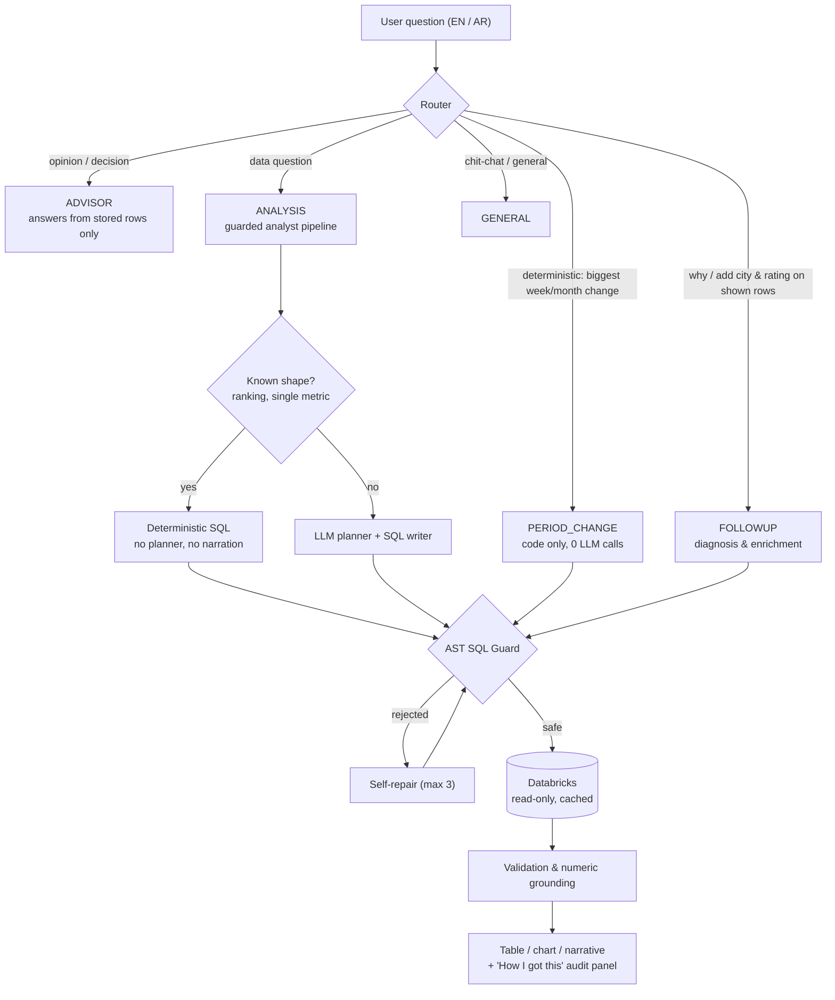
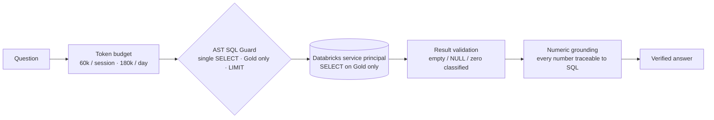
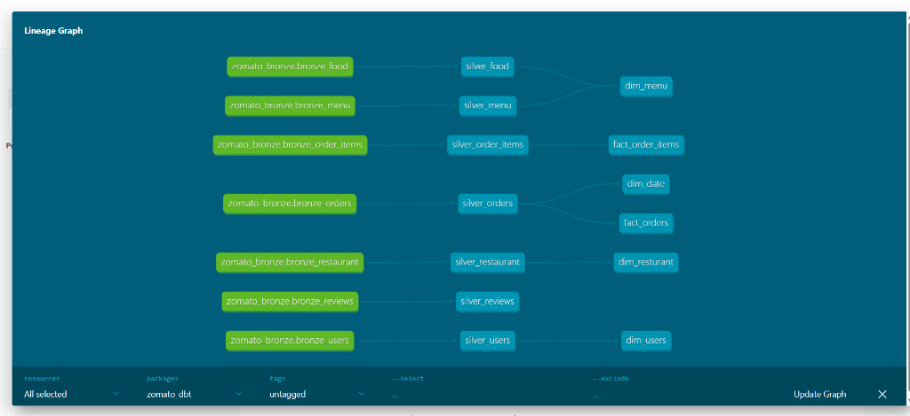
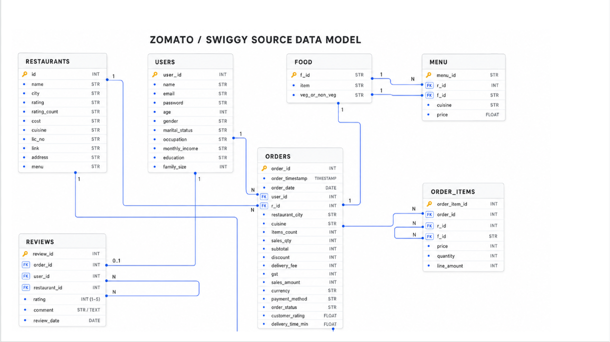
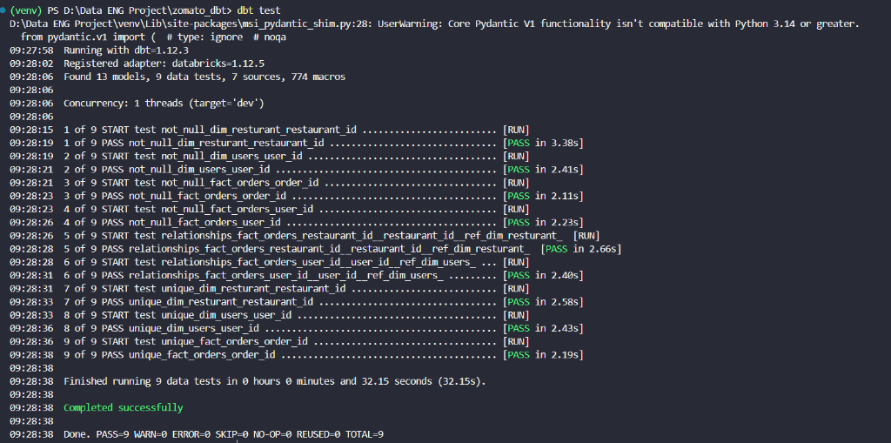
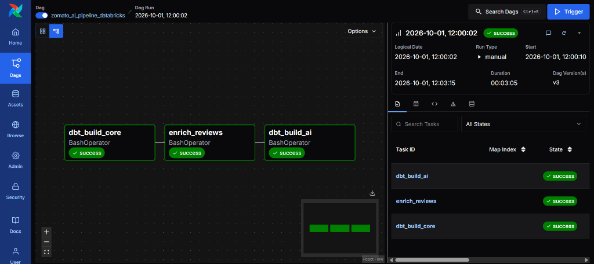
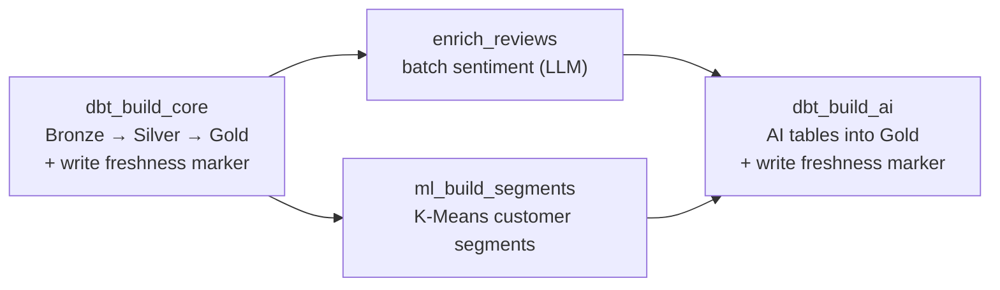

# 📊 Agentic Data Lakehouse

**An enterprise AI Data Analyst on a Databricks Lakehouse: guarded SQL, verified numbers, evidence-based root-cause analysis, and honest answers in English & Arabic.**

[](https://www.python.org/)
[](https://langchain-ai.github.io/langgraph/)
[](https://www.databricks.com/)
[](https://www.getdbt.com/)
[](https://airflow.apache.org/)
[](https://streamlit.io/)
[](tests/)

> **Ask your data business questions in plain English or Arabic.**
> The agent routes the question, writes Databricks SQL (or builds it deterministically when the question has a known shape), checks it with an AST safety guard, runs it read-only against a Gold star schema, and answers with numbers that trace back to executed queries. When the data cannot support a conclusion, it says so.

📐 Deep dive: [ARCHITECTURE.md](ARCHITECTURE.md) · 🧭 Design decisions: [DECISIONS.md](DECISIONS.md)

---

## 📑 Table of Contents

1. [Why this project](#-why-this-project)
2. [See it in action](#-see-it-in-action)
3. [How a question is answered](#-how-a-question-is-answered)
4. [Root-cause analysis you can trust](#-root-cause-analysis-you-can-trust)
5. [Safety & zero-hallucination guardrails](#-safety--zero-hallucination-guardrails)
6. [Caching & data freshness](#-caching--data-freshness)
7. [Observability](#-observability)
8. [Data platform (dbt + Medallion)](#-data-platform-dbt--medallion)
9. [Pipeline orchestration (Airflow)](#-pipeline-orchestration-airflow)
10. [Testing](#-testing)
11. [Getting started](#-getting-started)
12. [Project structure](#-project-structure)
13. [Author](#-author)

---

## 💡 Why this project

Text-to-SQL demos break in production: models invent columns, silently drop part of the question, narrate numbers they never computed, and blame a single entity for a broad trend. This project wraps the LLM in deterministic code so that **the model writes less and the system proves more**.

| Typical failure | How this project handles it |
| :--- | :--- |
| Unchecked SQL execution | **AST Safety Guard** (`sqlglot`): single `SELECT` only, Gold schema only, no DDL/DML or table-valued functions, automatic `LIMIT`. |
| Made-up numbers | **Numeric grounding**: every figure in a narrative must match executed query results. |
| Part of the question silently dropped | **Derived-measure handling**: "% of total", "share", "contribution" become SQL columns; if a requested column is missing from the result, the answer says so. |
| Wrong metric for the question | **Metric-aware diagnosis**: a low *order count* is never blamed on a small *basket size*. |
| Confident stories from noise | **Variability check**: the "biggest weekly drop" is compared with normal week-to-week swing, and reported as likely noise when it is. |
| Small samples treated as proof | **Confidence by sample size**: rate-based findings need a Wilson-interval test below 30 orders. |
| Stale cached answers | **Freshness markers**: every cache is invalidated when the pipeline rewrites Gold data. |
| Slow, expensive LLM chains | **Deterministic fast paths**: rankings, period comparisons, enrichment and diagnosis run as code, with 0 LLM calls where possible. |

---

## 🎬 See it in action

### "Which week had the biggest week-over-week decrease in revenue?"

This question shape is handled entirely by code (**0 LLM calls**). Real output on the project dataset:

```text
Largest decrease in revenue (week-over-week)
Week 2024-04-01 → 2024-04-07 vs 2024-03-25 → 2024-03-31: 23,753,785 vs 24,079,033
— change -325,248 (-1.35%).
Definition: largest absolute change between two consecutive full weeks
(129 comparisons, data 2024-01-01 to 2026-06-30). Partial periods are excluded.

Biggest contributors (brand level)
| Restaurant | prev week | this week | Change  | % change | Share of total decline |
| KFC        | 217,256   | 186,014   | -31,242 | -14.4%   | +9.6%                  |
| Subway     | 141,816   | 112,491   | -29,325 | -20.7%   | +9.0%                  |
| ...        |           |           |         |          |                        |

Measured breakdown: orders -23 (-0.0%), average order value -6.4 (-1.3%)
Arithmetic split: order-volume effect -11,221 + basket-size effect -314,027 = -325,248

Limits of this analysis
- This change (1.35%) is 1.8x the typical week-to-week swing (standard deviation 0.75%).
  With 129 comparisons, an extreme this size is expected by chance alone,
  so there may be no specific cause to find.
- This is association, not causation. The data has no traffic, marketing,
  holiday/season, weather or live-pricing information.
```

The week, both revenue values, the change and the comparison count were cross-checked against an independent Python computation from daily revenue and matched exactly.

### "Show me the top 10 restaurants with their percentage contribution to overall revenue"

The share is computed in SQL as a window over the grouped total, evaluated *before* `LIMIT`, so it is a share of **all** restaurants, not just the ten shown:

```sql
SELECT dr.restaurant_name,
       SUM(fo.sales_amount) AS revenue,
       ROUND(100.0 * SUM(fo.sales_amount) / NULLIF(SUM(SUM(fo.sales_amount)) OVER (), 0), 2) AS pct_of_total
FROM workspace.zomato_gold.fact_orders AS fo
JOIN workspace.zomato_gold.dim_resturant AS dr ON fo.restaurant_id = dr.restaurant_id
GROUP BY 1
ORDER BY revenue DESC, 1 ASC
LIMIT 10
```

### "Why so few orders?" (follow-up on the restaurants on screen)

The diagnosis measures each restaurant against the platform, its city and its cuisine, decomposes **orders = branches × orders per branch**, ranks root-cause candidates with a confidence level, attaches an action with a target KPI to each, and lists what was checked and found normal.

---

## 🔄 How a question is answered



Every route that touches data goes through the **same** safety guard and result cache. See [ARCHITECTURE.md](ARCHITECTURE.md) for node-level detail.

---

## 🔍 Root-cause analysis you can trust

Root-cause questions are where analysts usually lose trust, so each rule below is enforced in code and covered by tests:

- **Correct period.** Weeks are whole Monday–Sunday weeks and months are calendar months, inside the data's actual coverage. A partial first or last period can never be reported as "the biggest drop".
- **Exact arithmetic.** Changes, percentages and shares come from SQL. The revenue split into *order-volume* and *basket-size* effects is an exact identity (`R1 − R0 = (o1 − o0)·a0 + o1·(a1 − a0)`).
- **Evidence for every claim.** Each explanation cites a measured figure and a benchmark (platform, city, or cuisine).
- **Correlation vs. causation.** Answers state that the figures describe *what changed*, not proven cause.
- **Admits insufficient data.** If the extreme change is within normal variation, there are too few orders, or a column is empty (for example `cost` is NULL for 100% of restaurants), the answer says so instead of inventing a reason.
- **Regression to the mean.** If the previous period was unusually high, the answer notes that part of the drop is a return to normal.
- **Metric-aware.** Diagnosing a low *order count* uses `orders = branches × orders per branch` and never recommends "raise basket size".

---

## 🛡️ Safety & zero-hallucination guardrails



- **Least privilege:** a dedicated service principal with read-only access to `workspace.zomato_gold.*` ([`scripts/databricks_grants.sql`](scripts/databricks_grants.sql)).
- **AST SQL Guard:** parses every statement with `sqlglot` (Databricks dialect), blocks DDL/DML, multi-statement input and functions such as `read_files`, and injects `LIMIT 10000`. SQL built by code (period analysis, diagnosis, enrichment) goes through the same guard; values interpolated into SQL are strictly validated (for example dates must match `YYYY-MM-DD` in full).
- **Honest empty results:** no rows, all-NULL, and all-zero results are explained deterministically with the warehouse's real date coverage, and never narrated by the LLM.
- **Proportion discipline:** the narrative may not call something the "bulk" or "majority" unless SQL returned a share above 50%.
- **Resilience:** 30 s statement timeout, a bounded connection pool with reconnect-and-retry, and a circuit breaker with provider fallbacks.
- **Auditability:** every answer has a **"How I got this"** panel with the executed SQL, row counts and per-node latency/LLM telemetry.

---

## ⚡ Caching & data freshness

| Cache | Key | Lifetime | Invalidated by |
| :--- | :--- | :--- | :--- |
| **Query results** | SHA-256 of the `sqlglot`-normalized SQL | 1 h (`QUERY_CACHE_TTL_SECONDS`) | Pipeline marker, TTL, size/entry caps |
| **LLM responses** | node + model + effort + full prompt | 24 h | Any prompt change (schema, metrics) changes the key |
| **Gold schema** | in-process | 1 h | Pipeline marker |
| **Data coverage** (first/last order date) | in-process | 1 h | Pipeline marker |

- Query-cache writes are atomic, there is an in-memory LRU in front of the disk files, and identical concurrent queries are coalesced into one execution.
- **Freshness contract:** the Airflow DAG writes `metadata/last_ai_run.txt` after **both** `dbt_build_core` and `dbt_build_ai`. Anything cached before that timestamp is treated as stale, even if the AI steps later fail.

---

## 🔭 Observability

- **`eval/llm_telemetry.jsonl`**: one record per LLM call (node, provider, model, fallback flag, retries, prompt/completion/reasoning tokens, `finish_reason`, wall time).
- **`eval/executed_sql.jsonl`**: one record per executed or cache-served query (question, SQL, cache hit, row count, seconds, error), so empty or wrong results can be audited after the fact.
- The UI's "LLM calls" counter reflects real telemetry records, so cached and deterministic turns show 0.
- Tests redirect both logs to temporary files, so test runs never pollute real telemetry.

---

## 🏛️ Data platform (dbt + Medallion)

Raw operational data is transformed with **dbt** into a Kimball star schema on Databricks Delta Lake. Facts are incremental merges (timestamp watermark with a 3-day lookback), so daily runs stay cheap.

<div align="center">
  
</div>

<div align="center">
  
</div>

| Table | Grain | Key columns | Rows |
| :--- | :--- | :--- | ---: |
| `fact_orders` | one row per order | `order_id`, `user_id`, `restaurant_id`, `date_id`, `sales_amount`, `discount` | 10,000,000 |
| `fact_order_items` | one row per line item | `order_id`, `food_id`, `quantity`, `price` | ~23,000,000 |
| `dim_resturant` | one row per **branch** (`restaurant_name` is the brand) | `restaurant_id`, `restaurant_name`, `city`, `rating`, `cuisine` | 148,541 |
| `dim_menu` | one row per menu item | `menu_id`, `restaurant_id`, `item_name`, `cuisine` | 1,179,936 |
| `dim_users` | one row per customer | `user_id`, `age_group`, `occupation`, `customer_segment` | 100,000 |
| `dim_date` | one row per date | `date_id`, `full_date`, `year`, `month_number` | 912 |

Brand-level questions always group by `restaurant_name`; customers are grouped by `user_id` *and* name because names are not unique.

<div align="center">
  
</div>

---

## 🕒 Pipeline orchestration (Airflow)

<div align="center">
  
</div>

DAG `zomato_ai_pipeline_databricks` (daily, `max_active_runs=1`, retries with exponential backoff, per-task and per-run timeouts):



- **`enrich_reviews`**: incremental, de-duplicated, batched (25 reviews/request) async sentiment classification with bounded concurrency and `retry-after` backoff.
- **`ml_build_segments`**: K-Means segmentation (e.g. *High Value*, *Loyal*, *Occasional*, *At Risk*) loaded in bulk via Parquet and a Unity Catalog volume, materialised as `ai_customer_segments`.

---

## 🧪 Testing

**315 tests** across 26 files cover security (AST guard), numeric grounding, routing, deterministic SQL, caching, resilience, diagnosis accuracy, period analysis and observability.

```bash
python -m pytest tests -q
```

Notable regression suites: derived measures (`test_derived_measures.py`), period-over-period analysis (`test_period_change.py`), diagnosis accuracy (`test_diagnosis_accuracy.py`), cache freshness (`test_cache_freshness.py`) and observability (`test_observability.py`). `tests/conftest.py` isolates caches and telemetry files so tests never touch real runtime data.

---

## 💻 Getting started

### Prerequisites
Python 3.12+ · a Databricks SQL warehouse with the Gold schema · a Groq API key (OpenRouter optional fallback) · Docker (for Airflow)

### Install
```bash
git clone https://github.com/shehapsherif11-bit/Agentic-Data-Lakehouse.git
cd Agentic-Data-Lakehouse

python -m venv venv
.\venv\Scripts\activate        # Linux/macOS: source venv/bin/activate
pip install -r requirements.txt
```

### Configure
Create a `.env` in the project root (it is git-ignored):
```env
DATABRICKS_HOST=your-workspace.cloud.databricks.com
DATABRICKS_HTTP_PATH=/sql/1.0/warehouses/your-warehouse-id
DATABRICKS_TOKEN=dapi...
GROQ_API_KEY=gsk_...
```

Optional tuning (defaults in parentheses): `STATEMENT_TIMEOUT_SECONDS` (30), `DB_POOL_SIZE` (3), `QUERY_CACHE_TTL_SECONDS` (3600), `LLM_CACHE_TTL_SECONDS` (86400), `SESSION_TOKEN_LIMIT` (60000), `DAILY_TOKEN_LIMIT` (180000), `ENRICH_MAX_REVIEWS` (500; `0` = all), `AI_RUN_MARKER_PATH` (`metadata/last_ai_run.txt`).

### Run
```bash
streamlit run app.py                 # chat UI
cd zomato_dbt && dbt build           # build the lakehouse models
```

---

## 📂 Project structure

```text
Agentic-Data-Lakehouse/
├── app.py                        # Streamlit chat UI + audit panel
├── ARCHITECTURE.md · DECISIONS.md
├── src/
│   ├── agent/
│   │   ├── router_graph.py       # Master router (ANALYSIS · FOLLOWUP · ADVISOR · PERIOD_CHANGE · GENERAL)
│   │   ├── analyst_graph.py      # Guarded analytical pipeline (LangGraph)
│   │   ├── period_change.py      # Deterministic "biggest week/month change" analysis
│   │   ├── diagnostics.py        # Root-cause scoring, decomposition, confidence
│   │   ├── followups.py          # Diagnosis & enrichment of restaurants on screen
│   │   ├── advisor.py            # Evidence-bound opinion/decision answers
│   │   ├── query_intent.py       # Deterministic top-N, direction, derived measures
│   │   ├── metrics_registry.py   # Metric catalog, sufficiency checks
│   │   ├── sql_safety_guard.py   # AST-based SQL guard (sqlglot)
│   │   ├── numeric_grounding.py  # Verifies narrative numbers against results
│   │   ├── result_classifier.py  # Empty / NULL / zero explanations
│   │   ├── ranking_text.py       # Table-first ranking answers
│   │   ├── query_cache.py · llm_cache.py
│   │   ├── token_budget.py · telemetry.py · llm_factory.py
│   │   └── viz_engine.py         # Plotly charts
│   └── utils/                    # Databricks pool, concurrency, pipeline marker
├── zomato_dbt/                   # dbt models: silver/ and gold/ (star schema)
├── airflow/                      # Dockerized DAG + AI tasks (sentiment, K-Means)
├── scripts/databricks_grants.sql # Least-privilege permissions
├── tests/                        # 315 tests
└── docs/images/                  # Lineage, ERD, DAG screenshots
```

---

## 👨‍💻 Author

**Shehab El-Batanouny** — Data Analyst & Data Engineering Specialist
[GitHub @shehapsherif11-bit](https://github.com/shehapsherif11-bit) · [LinkedIn](https://www.linkedin.com/in/shehapsherif/)
